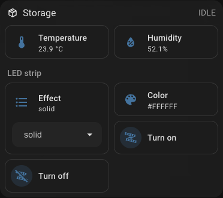
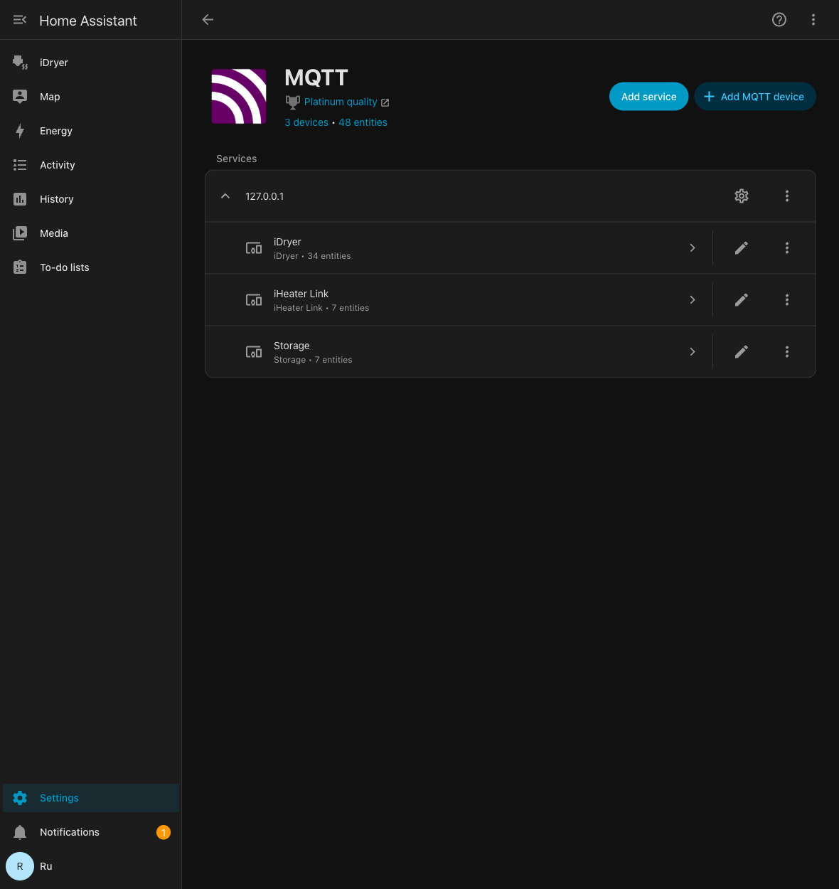
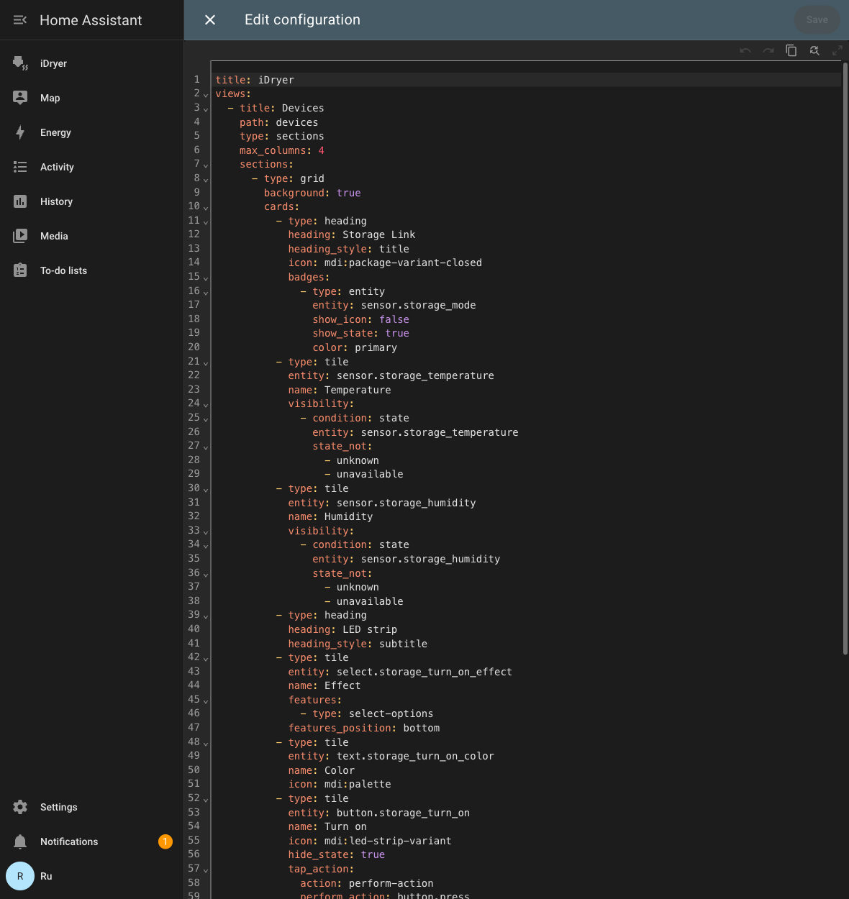

# Home Assistant

Storage Link meldet sich in Home Assistant über **MQTT Discovery** an: HA erstellt die Entitäten selbst — Temperatur und Luftfeuchtigkeit vom Sensor SHT31, die Auswahl des Effekts, die Farbe und die Schaltflächen zur Steuerung des Bands. Das Portal wird dafür nicht benötigt, alles läuft über Ihren MQTT-Broker.

Nachfolgend: die Integration einschalten, prüfen und ein fertiges Karten-Layout, damit das Gerät aufgeräumt aussieht und nicht wie eine Liste von Entitäten.


*Die Messwerte des Sensors und die Steuerung des Bands in einem Block.*

!!! note
    Das Gerät **erscheint nicht** unter `Settings → Devices & services → Discovered`: Das ist MQTT Discovery, nicht UPnP/zeroconf. Die Integration **MQTT** muss in Home Assistant bereits hinzugefügt sein.

## Was benötigt wird

1. Ein MQTT-Broker: das Add-on **Mosquitto broker** in Home Assistant oder ein beliebiger Broker in Ihrem Netzwerk.
2. Die in Home Assistant hinzugefügte Integration **MQTT**, die auf diesen Broker zeigt.
3. Storage Link im Netzwerk und `Online` auf dem Portal.

## Schritt 1. Die Integration am Gerät einschalten

Öffnen Sie das Gerät auf [portal.idryer.org](https://portal.idryer.org/) und suchen Sie den Block **Integrationen** → **Home Assistant**.

| Feld | Was einzutragen ist |
|---|---|
| Host | die Adresse des Brokers in Ihrem Netzwerk, zum Beispiel `192.168.1.27` |
| Port | der Port des Brokers, üblicherweise `1883` |
| Username / Password | die Zugangsdaten des Brokers, falls er sie verlangt |
| Discovery prefix | `homeassistant`, sofern Sie ihn in den HA-Einstellungen nicht geändert haben |
| Aktiviert | das Häkchen — sonst verbindet sich das Gerät nicht mit dem Broker |

Die Einstellungen gehen über das lokale Netzwerk direkt an das Gerät — das Portal speichert sie nicht.


*Die Adresse des Brokers, der Port und das Kennzeichen „Aktiviert“ — mehr braucht das Gerät nicht.*

## Schritt 2. Das Gerät in Home Assistant finden

`Settings` → `Devices & services` → die Karte **MQTT** → klappen Sie im Abschnitt **Services** den Knoten des Brokers auf. Die iDryer-Geräte erscheinen unter Seriennummern der Form `DEVICE_*`.


*Die Geräte unter dem Knoten des Brokers; bei Storage ist die Anzahl der Entitäten zu sehen.*

Öffnen Sie das Gerät: HA zeigt bereits die Messwerte und die Bedienelemente des Bands.

## Schritt 3. Die Karte zusammenstellen

HA ordnet die Entitäten selbst an, und es entsteht eine lange Liste. Das fertige Layout stellt die Messwerte nach oben und die Steuerung des Bands in einen eigenen Block.

1. `Settings` → `Dashboards` → **Add dashboard** → ein leeres Dashboard, öffnen Sie es.
2. Rechte obere Ecke → der Stift (**Edit**) → das Menü „⋮“ → **Raw configuration editor**.
3. Fügen Sie den nachfolgenden Inhalt ein und speichern Sie.

Das Layout ist für ein Dashboard des Typs `sections` ausgelegt.

```yaml
title: iDryer
views:
- title: Devices
  path: devices
  type: sections
  max_columns: 4
  sections:
  - type: grid
    background: true
    cards:
    - type: heading
      heading: Storage Link
      heading_style: title
      icon: mdi:package-variant-closed
      badges:
      - type: entity
        entity: sensor.storage_mode
        show_icon: false
        show_state: true
        color: primary
    - type: tile
      entity: sensor.storage_temperature
      name: Temperature
      visibility:
      - condition: state
        entity: sensor.storage_temperature
        state_not:
        - unknown
        - unavailable
    - type: tile
      entity: sensor.storage_humidity
      name: Humidity
      visibility:
      - condition: state
        entity: sensor.storage_humidity
        state_not:
        - unknown
        - unavailable
    - type: heading
      heading: LED strip
      heading_style: subtitle
    - type: tile
      entity: select.storage_turn_on_effect
      name: Effect
      features:
      - type: select-options
      features_position: bottom
    - type: tile
      entity: text.storage_turn_on_color
      name: Color
      icon: mdi:palette
    - type: tile
      entity: button.storage_turn_on
      name: Turn on
      icon: mdi:led-strip-variant
      hide_state: true
      tap_action: &id001
        action: perform-action
        perform_action: button.press
        target:
          entity_id: button.storage_turn_on
      icon_tap_action: *id001
    - type: tile
      entity: button.storage_turn_off
      name: Turn off
      icon: mdi:led-strip-variant-off
      hide_state: true
      tap_action: &id002
        action: perform-action
        perform_action: button.press
        target:
          entity_id: button.storage_turn_off
      icon_tap_action: *id002
```


*Dasselbe Layout im Konfigurationseditor des Dashboards.*

Die Farbe wird als Zeichenkette im Feld **Farbe** angegeben — sechsstelliger HEX-Wert ohne Raute, zum Beispiel `FF8800`. Die Animation wird aus einer Liste gewählt, die das Gerät selbst veröffentlicht: Bei älteren Storage-Firmwares gibt es weniger Varianten.

## Wenn die Namen der Entitäten nicht übereinstimmen

Das Layout ist für Standardbezeichner der Form `sensor.storage_temperature` ausgelegt. Zeigt die Karte „Entity not found“, sehen Sie Ihre eigenen nach: `Settings` → `Devices & services` → **MQTT** → Ihr Gerät → die Liste der Entitäten — und ersetzen Sie das Präfix im Layout durch Ihres.

## Diagnose

| Symptom | Was zu prüfen ist |
|---|---|
| Das Gerät ist nicht in HA erschienen | Auf dem Portal ist bei der Integration Home Assistant das Häkchen „Aktiviert“ gesetzt, Adresse und Port des Brokers stimmen. Das Gerät muss `Online` sein. |
| Es ist erschienen, aber es gibt keine Temperatur und Luftfeuchtigkeit | Der Sensor SHT31 ist nicht angeschlossen oder antwortet nicht: Ohne Sensor veröffentlicht das Gerät diese Entitäten nicht. |
| Die Schaltflächen reagieren nicht | Prüfen Sie, dass der Broker das Veröffentlichen in die Topics `idryer/#` erlaubt und dass im Log des Geräts keine Autorisierungsfehler stehen. |
| Phantom-Entitäten mit dem Wert `Unknown` | Es sind Retained-Nachrichten der früheren Firmware übrig geblieben. Löschen Sie sie: `mosquitto_pub -h <Broker> -t 'homeassistant/<...>/config' -n -r`. |
