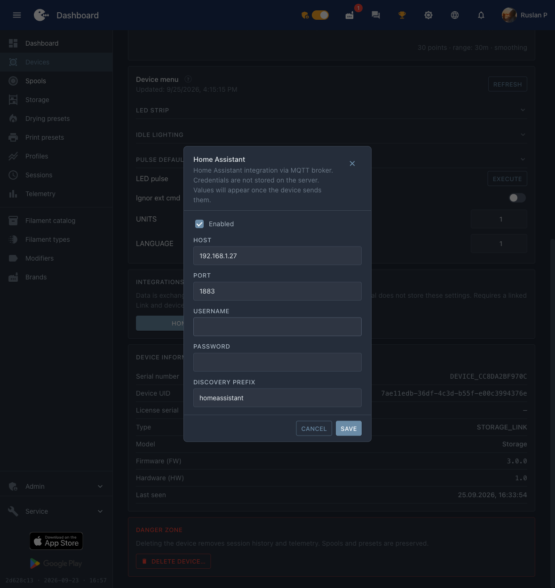

# Home Assistant

Storage Link se publie dans Home Assistant via **MQTT Discovery** : HA crée lui-même les entités — température et humidité du capteur SHT31, choix de l'effet, couleur et boutons de commande du ruban. Le portail n'est pas nécessaire, tout passe par votre broker MQTT.

Ci-dessous : l'activation de l'intégration, la vérification et une disposition de carte prête à l'emploi, pour que l'appareil ait un aspect soigné et non celui d'une liste d'entités.


*Les relevés du capteur et la commande du ruban dans un seul bloc.*

!!! note
    L'appareil **n'apparaîtra pas** dans `Settings → Devices & services → Discovered` : il s'agit de MQTT Discovery, pas d'UPnP/zeroconf. L'intégration **MQTT** doit être ajoutée au préalable dans Home Assistant.

## Prérequis

1. Un broker MQTT : le module complémentaire **Mosquitto broker** dans Home Assistant ou tout autre broker de votre réseau.
2. L'intégration **MQTT** ajoutée dans Home Assistant et pointant vers ce broker.
3. Storage Link présent sur le réseau et `Online` sur le portail.

## Étape 1. Activer l'intégration sur l'appareil

Ouvrez l'appareil sur [portal.idryer.org](https://portal.idryer.org/) et trouvez le bloc **Intégrations** → **Home Assistant**.

| Champ | Que saisir |
|---|---|
| Host | l'adresse du broker dans votre réseau, par exemple `192.168.1.27` |
| Port | le port du broker, généralement `1883` |
| Username / Password | les identifiants du broker, s'il les exige |
| Discovery prefix | `homeassistant`, si vous ne l'avez pas modifié dans les paramètres de HA |
| Activé | la case à cocher — sinon l'appareil ne se connectera pas au broker |

Les paramètres sont transmis directement à l'appareil via le réseau local — le portail ne les conserve pas.


*L'adresse du broker, le port et la case « Activé » — c'est tout ce dont l'appareil a besoin.*

## Étape 2. Trouver l'appareil dans Home Assistant

`Settings` → `Devices & services` → carte **MQTT** → dans la section **Services**, développez le nœud du broker. Les appareils iDryer y figurent sous des numéros de série de la forme `DEVICE_*`.


*Les appareils sous le nœud du broker ; pour Storage, le nombre d'entités est indiqué.*

Ouvrez l'appareil : HA affiche déjà les relevés et les éléments de commande du ruban.

## Étape 3. Composer la carte

HA dispose les entités lui-même, ce qui donne une longue liste. La disposition prête à l'emploi place les relevés en haut et la commande du ruban dans un bloc distinct.

1. `Settings` → `Dashboards` → **Add dashboard** → un tableau de bord vide, ouvrez-le.
2. Coin supérieur droit → crayon (**Edit**) → menu « ⋮ » → **Raw configuration editor**.
3. Collez le contenu ci-dessous et enregistrez.

La disposition est prévue pour un tableau de bord de type `sections`.

```yaml
title: iDryer
views:
- title: Devices
  path: devices
  type: sections
  max_columns: 4
  sections:
  - type: grid
    background: true
    cards:
    - type: heading
      heading: Storage Link
      heading_style: title
      icon: mdi:package-variant-closed
      badges:
      - type: entity
        entity: sensor.storage_mode
        show_icon: false
        show_state: true
        color: primary
    - type: tile
      entity: sensor.storage_temperature
      name: Temperature
      visibility:
      - condition: state
        entity: sensor.storage_temperature
        state_not:
        - unknown
        - unavailable
    - type: tile
      entity: sensor.storage_humidity
      name: Humidity
      visibility:
      - condition: state
        entity: sensor.storage_humidity
        state_not:
        - unknown
        - unavailable
    - type: heading
      heading: LED strip
      heading_style: subtitle
    - type: tile
      entity: select.storage_turn_on_effect
      name: Effect
      features:
      - type: select-options
      features_position: bottom
    - type: tile
      entity: text.storage_turn_on_color
      name: Color
      icon: mdi:palette
    - type: tile
      entity: button.storage_turn_on
      name: Turn on
      icon: mdi:led-strip-variant
      hide_state: true
      tap_action: &id001
        action: perform-action
        perform_action: button.press
        target:
          entity_id: button.storage_turn_on
      icon_tap_action: *id001
    - type: tile
      entity: button.storage_turn_off
      name: Turn off
      icon: mdi:led-strip-variant-off
      hide_state: true
      tap_action: &id002
        action: perform-action
        perform_action: button.press
        target:
          entity_id: button.storage_turn_off
      icon_tap_action: *id002
```


*La même disposition dans l'éditeur de configuration du tableau de bord.*

La couleur se saisit sous forme de chaîne dans le champ **Couleur** — un code HEX à six chiffres sans dièse, par exemple `FF8800`. L'animation se choisit dans la liste que l'appareil publie lui-même : les anciens micrologiciels de Storage proposent moins d'options.

## Si les noms des entités ne correspondent pas

La disposition est prévue pour des identifiants standard de la forme `sensor.storage_temperature`. Si la carte affiche « Entity not found », consultez les vôtres : `Settings` → `Devices & services` → **MQTT** → votre appareil → liste des entités, — et remplacez le préfixe dans la disposition par le vôtre.

## Diagnostic

| Symptôme | À vérifier |
|---|---|
| L'appareil n'apparaît pas dans HA | Sur le portail, la case « Activé » de l'intégration Home Assistant est cochée, l'adresse et le port du broker sont corrects. L'appareil doit être `Online`. |
| Il apparaît, mais la température et l'humidité manquent | Le capteur SHT31 n'est pas branché ou ne répond pas : sans capteur, l'appareil ne publie pas ces entités. |
| Les boutons ne réagissent pas | Vérifiez que le broker autorise la publication dans les topics `idryer/#` et que le journal de l'appareil ne contient pas d'erreurs d'autorisation. |
| Entités fantômes avec la valeur `Unknown` | Des messages retained d'un ancien micrologiciel subsistent. Nettoyez-les : `mosquitto_pub -h <broker> -t 'homeassistant/<...>/config' -n -r`. |
