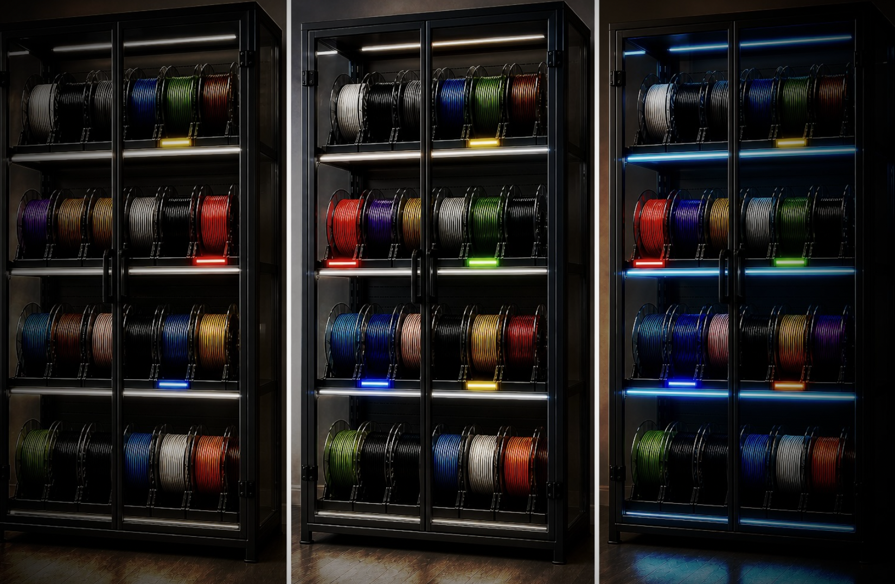
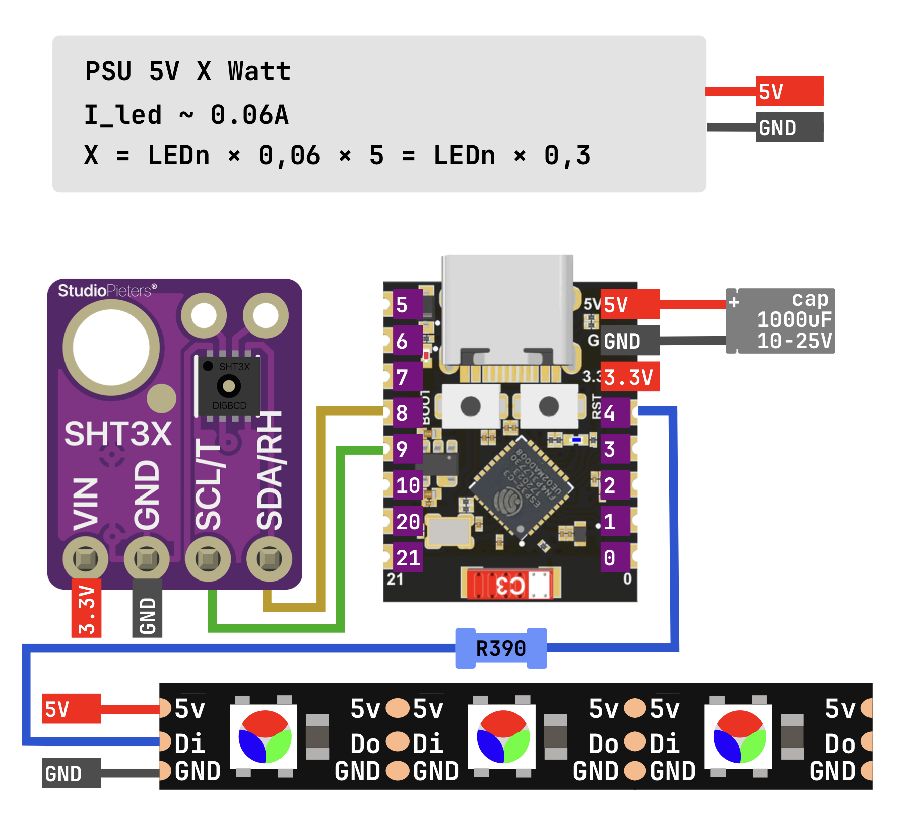
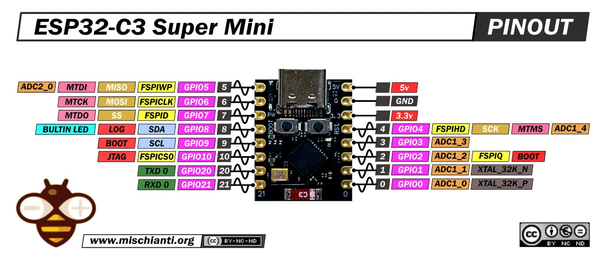
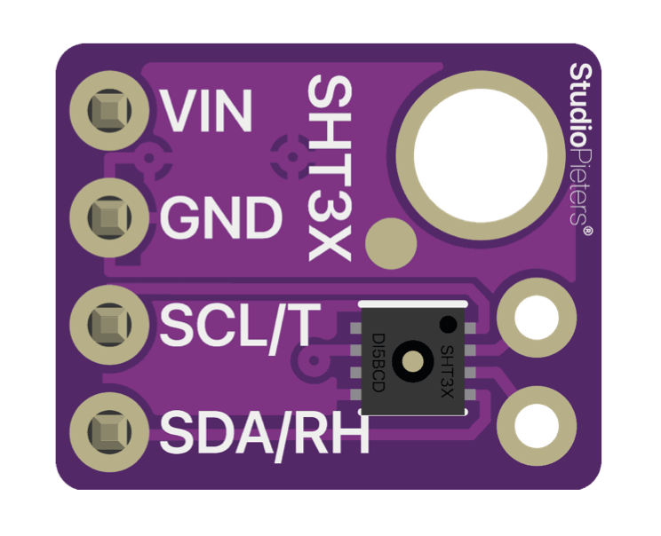

# Storage Link — クイックスタートガイド

Storage Link は ESP32 ベースのモジュールで、アドレス指定可能な LED テープをフィラメント格納庫のインジケーターに変換し、オプションで SHT31 センサーから温度と湿度を公開します。

- Wi-Fi に接続し、デバイスを [portal.idryer.org](https://portal.idryer.org/) と連携します。
- クラウドまたはローカルアプリケーションからのコマンドで、指定された時間指定された色でスロットを点灯します。
- SHT31 センサーが装着されている場合、温度と湿度を公開します。

ストレージと巻枠に関する知識は外部アプリケーションに存在します。ファームウェアは「スロット N を色 C で T 秒間点灯させる」というシンプルな実行モジュールとして動作します。これにより、任意の棚にテープを貼り付け、ファームウェアに関係なくポータルで説明することができます。

## サポートされているボード

| ボード                       |       |
| ---------------------------- | ----- |
| ESP32-C3 DevKitM-1           | `✅`  |
| ESP32-C3 Super Mini          | `✅`  |
| Seeed XIAO ESP32-S3          | `✅`  |
| Waveshare ESP32-S3-Zero      | `✅`  |

他の ESP32-C3 または ESP32-S3 ベースのボードでも、LED テープ用の空きGPIO と I2C 用の GPIO ペアがあれば使用できます。メーカーの配置図を参照してください。

## 配線図

!!! warning "電源投入時にケーブルを接続または切断しないでください。"

Storage Link は 1 つの信号 GPIO (`DATA`) でテープを制御し、オプションで I2C 経由で SHT31 を読み取ります。

### LED テープの電源

LED テープと ESP は、テープの実際の負荷に対応する電源から電力を供給される必要があります。

- 多くの ESP ボードでは、`5V` (`VBUS`) ピンが USB コネクタから直接出力されます。使用している USB 電源アダプターがテープの負荷に対応できる電流を供給できる場合、ESP とテープを USB 電源から並列に供給することは許容されます。
- 十分な電流がない場合、テープの電源は別の 5V 電源に接続されます。電源の GND は必ず ESP の `GND` に接続されます。共通グランドがないと `DATA` 信号が機能しません。

どちらの場合でも、メニューの `psu_ma` に実際に供給できる 5V の電流を記入する必要があります。これは「希望値」ではなく、電源の仕様上の定格値です。FastLED はこの値に基づいて総合的な輝度を制限し、制限を超えないようにします。

### 実装のベストプラクティス

これらの要素は起動に必須ではありませんが、アドレス指定可能な LED テープの典型的な問題（ピクセルスキップ、最初の LED の「グリッチ」、有効時の降下）を排除します。

- **`DATA` ラインのレジスタ。** ESP GPIO と LED テープの `DIN` 間に直列に `300–500 Ω` のレジスタ（標準 `390 Ω`）を配置し、物理的にはテープに可能な限り近い位置に配置します。シグナルリフレクションを減衰させ、テープの最初のチップを保護します。
- **電源用電解コンデンサ。** LED テープの電力入口の `+5V` と `GND` 間に `1000 µF` `16V` 品 (`25V` 品でも問題なく、`10V` 品が最小) を配置します。突然のオン時の電流スパイクを平滑化します。
- **電源グランドセクション。** ESP—テープ—電源間のグランドワイヤーは、テープのピーク電流に対応する必要があります。短いワイヤー (最大約 1 m) の目安：

    | 電源電流      | 断面積        | AWG       |
    | ------------- | ------------- | --------- |
    | 最大 3 A      | `0.5 mm²`     | `AWG 20`  |
    | 最大 5 A      | `0.75 mm²`    | `AWG 18`  |

    `+5V` ラインからテープへも同じ断面を使用します。長いテープの場合、両端から電源を供給します。

### シグナル接続

GPIO の値はボードに依存します。

#### ESP32-C3 DevKitM-1 および ESP32-C3 Super Mini

| ESP        | 機能                        |
| ---------- | --------------------------- |
| `GPIO4`    | LED テープの `DATA`         |
| `GPIO8`    | `SDA` (SHT31、オプション)   |
| `GPIO9`    | `SCL` (SHT31、オプション)   |
| `GND`      | テープと電源との共通グランド |

#### Seeed XIAO ESP32-S3

| ESP        | 機能                        |
| ---------- | --------------------------- |
| `GPIO2`    | LED テープの `DATA`         |
| `GPIO5`    | `SDA` (SHT31、オプション)   |
| `GPIO6`    | `SCL` (SHT31、オプション)   |
| `GND`      | テープと電源との共通グランド |

#### Waveshare ESP32-S3 Zero

| ESP        | 機能                        |
| ---------- | --------------------------- |
| `GPIO4`    | LED テープの `DATA`         |
| `GPIO8`    | `SDA` (SHT31、オプション)   |
| `GPIO9`    | `SCL` (SHT31、オプション)   |
| `GND`      | テープと電源との共通グランド |

### ボードのピン配置

ESP32-C3 Super Mini:

Waveshare ESP32-S3-Zero:

## オプションの SHT31 センサー

センサーは、このデバイスで温度と湿度を公開したい場合にのみ必要です。Storage Link は、センサーの有無に関わらず、同じようにテープで起動および動作します。センサーがインストールされていない場合、温度と湿度は単に送信されません。

- バス: ボード対応の `SDA`/`SCL` 上の I2C。
- アドレス: `0x44` または `0x45` (ファームウェアは起動時に自動的に検出します)。

## Web フラッシャーでのファームウェア書き込み

Web フラッシャーは [install.idryer.org](https://install.idryer.org/) にあります。

1. Storage Link をコンピューターの USB ポートに接続します。
2. [install.idryer.org](https://install.idryer.org/) を開いて、**Storage Link** ボタンをクリックします。
3. ボードの選択肢を選択します。
4. **Connect** をクリックして、シリアルポートを選択します。デバイスが認識されない場合は、ボード上の `BOOT` ボタンを押し続けて、`RST` をタップします。
5. **Install** をクリックします。フラッシャーがファームウェアを書き込みます。
6. ファームウェア書き込みが完了したら、Wi-Fi セットアップウィザードが開きます。

## Wi-Fi セットアップ

ファームウェア書き込み後、Improv ウィザードがシリアルポートに自動的に開きます。

1. 2.4 GHz ネットワークの SSID とパスワードを入力します。
2. **Connected** ステータスが表示されるまで待ちます。

ウィザードが開かない場合は、USB を切断して、ファームウェア再書き込みなしで **Connect** 経由で再度接続します。

!!! note "ESP32-C3 と ESP32-S3 は Wi-Fi 2.4 GHz のみをサポートしています。5 GHz ネットワークは機能しません。"

## ポータルへのバインド

1. フラッシャーページで **接続して Claim を実行** をクリックします。デバイスに claim コマンドが送信されます。
2. 数秒後、ページに PIN が表示されます。PIN は約 5 分間有効です。
3. [portal.idryer.org](https://portal.idryer.org/) → **デバイスを追加** → PIN を入力します。
4. バインドが成功すると、デバイスがオンラインリストに表示されます。

PIN が表示されない場合、またはバインドが失敗した場合は、claim を繰り返すか、ポータルでデバイスを削除して再度試してください。

## LED テープのセットアップ

パラメーターはデバイス設定メニューで設定します。一部は即座に適用され、一部は再起動後にのみ適用されます。

| パラメーター     | 値                                | デフォルト | 適用タイミング |
| -------------- | --------------------------------- | --------- | ------------- |
| `led_count`    | `1..300`、ステップ `1`            | `120`     | 即座          |
| `psu_ma`       | `500..20000` mA、ステップ `100`   | `5000`    | 即座          |
| テープタイプ   | メニューの利用可能な選択肢から選択 | `WS2812B` | reboot後      |
| カラーオーダー | `GRB`、`RGB`、`BRG`、`BGR`       | `GRB`     | reboot後      |
| `language`     | `ru` / `en`                       | `en`      | 即座          |

初回起動後の基本的なチェックリスト:

1. `led_count` を設定します。テープ上の実際のピクセル数です。
2. `psu_ma` を設定します。5V 電源の定格電流 (ミリアンペア単位) です。
3. インストールされているテープタイプを選択します。
4. カラーオーダーを選択します。デフォルトは `GRB` です。赤と緑が入れ替わったり、色が正しくない場合は、オプションを試してください。
5. デバイスを再起動します。テープタイプとカラーオーダーは reboot 後にのみ適用されます。

## 期待される結果

- Claim 後、デバイスはポータルにオンラインで表示されます。
- ポータルまたはアプリケーションからの点灯コマンドは、テープ上で選択されたスロットを指定された時間点灯させます。新しいコマンドは前のスロットを消灯させ、次のスロットを点灯させます。
- SHT31 がインストールされている場合、温度と湿度がポータルに定期的に更新されます。
- SHT31 がインストールされていない場合、気候指標がないのは正常です。
